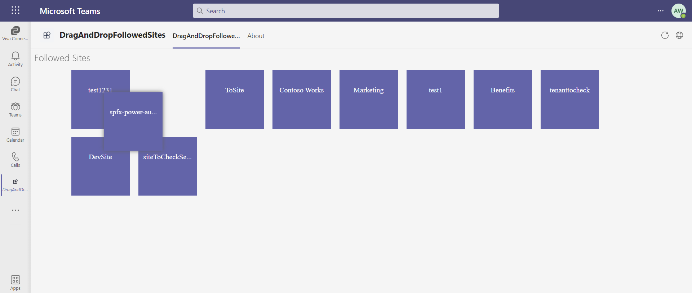

# Followed Drag and Drop Grid

## Summary

This web part is a good example (starting point) for a solution to implement alternative view for user followed sites (or any kind of links). The web part uses Microsoft Graph so it presents how to define needed web api permissions in package-solution and use MS Graph API endpoints.

how it looks on SP site

how it looks in Teams

when user does not have any followed sites

Another cool feature is also done using MS Graph in order to save or update the order of the links as a `.json` file in special approot folder which is kept on each individual user OneDrive. Thanks to that the web part may keep the user order of the links in one place where it may be easily used in a SharePoint page or in Teams.

## Compatibility

| :warning: Important          |
|:---------------------------|
| Every SPFx version is only compatible with specific version(s) of Node.js. In order to be able to build this sample, please ensure that the version of Node on your workstation matches one of the versions listed in this section. This sample will not work on a different version of Node.|
|Refer to <https://aka.ms/spfx-matrix> for more information on SPFx compatibility.   |

 

-Incompatible-red.svg "SharePoint Server 2016 Feature Pack 2 requires SPFx 1.1")

## Applies to

- [SharePoint Framework](https://aka.ms/spfx)
- [Microsoft 365 tenant](https://learn.microsoft.com/sharepoint/dev/spfx/set-up-your-developer-tenant)

## Prerequisites

As this solution uses Microsoft Graph to get user followed sites it is required to approve all web api permission requests in SharePoint Admin page https://YourCoolTenantNameHere-admin.sharepoint.com/_layouts/15/online/AdminHome.aspx#/webApiPermissionManagement

## Contributors

* [Adam Wójcik](https://github.com/Adam-it)

## Version history

Version|Date|Comments
-------|----|--------
1.0|January 09, 2022|Initial release

## Minimal Path to Awesome

- Clone this repository (or [download this solution as a .ZIP file](https://pnp.github.io/download-partial/?url=https://github.com/pnp/sp-dev-fx-webparts/tree/main/samples/react-followed-drag-and-drop-grid) then unzip it)
- Ensure that you are at the solution folder
- in the command-line run:
  - `npm install`
  - `gulp serve`
  - `gulp bundle --ship`
  - `gulp package-solution --ship`
  - Add to AppCatalog and deploy
  - Approve the MS Graph API permissions in SharePoint Admin page

>  This sample can also be opened with [VS Code Remote Development](https://code.visualstudio.com/docs/remote/remote-overview). Visit https://aka.ms/spfx-devcontainer for further instructions.

## Features

Description of the extension that expands upon high-level summary above.

This extension illustrates the following concepts:

- how to use Microsoft Graph api and get user followed sites or use special approot on user OneDrive
- how to save/update data in a json file special approot folder on user OneDrive as a place to keep data a use in SharePoint or Teams
- how to create a simple alternative drag and drop view for links

## References

- [Getting started with SharePoint Framework](https://learn.microsoft.com/sharepoint/dev/spfx/set-up-your-developer-tenant)
- [Building for Microsoft teams](https://learn.microsoft.com/sharepoint/dev/spfx/build-for-teams-overview)
- [Use Microsoft Graph in your solution](https://learn.microsoft.com/sharepoint/dev/spfx/web-parts/get-started/using-microsoft-graph-apis)
- [Publish SharePoint Framework applications to the Marketplace](https://learn.microsoft.com/sharepoint/dev/spfx/publish-to-marketplace-overview)
- [Microsoft 365 Patterns and Practices](https://aka.ms/m365pnp) - Guidance, tooling, samples and open-source controls for your Microsoft 365 development

## Help

We do not support samples, but this community is always willing to help, and we want to improve these samples. We use GitHub to track issues, which makes it easy for  community members to volunteer their time and help resolve issues.

If you're having issues building the solution, please run [spfx doctor](https://pnp.github.io/cli-microsoft365/cmd/spfx/spfx-doctor/) from within the solution folder to diagnose incompatibility issues with your environment.

You can try looking at [issues related to this sample](https://github.com/pnp/sp-dev-fx-webparts/issues?q=label%3A%22sample%3A%20react-followed-drag-and-drop-grid%22) to see if anybody else is having the same issues.

You can also try looking at [discussions related to this sample](https://github.com/pnp/sp-dev-fx-webparts/discussions?discussions_q=react-followed-drag-and-drop-grid) and see what the community is saying.

If you encounter any issues while using this sample, [create a new issue](https://github.com/pnp/sp-dev-fx-webparts/issues/new?assignees=&labels=Needs%3A+Triage+%3Amag%3A%2Ctype%3Abug-suspected%2Csample%3A%20react-followed-drag-and-drop-grid&template=bug-report.yml&sample=react-followed-drag-and-drop-grid&authors=@Adam-it&title=react-followed-drag-and-drop-grid%20-%20).

For questions regarding this sample, [create a new question](https://github.com/pnp/sp-dev-fx-webparts/issues/new?assignees=&labels=Needs%3A+Triage+%3Amag%3A%2Ctype%3Aquestion%2Csample%3A%20react-followed-drag-and-drop-grid&template=question.yml&sample=react-followed-drag-and-drop-grid&authors=@Adam-it&title=react-followed-drag-and-drop-grid%20-%20).

Finally, if you have an idea for improvement, [make a suggestion](https://github.com/pnp/sp-dev-fx-webparts/issues/new?assignees=&labels=Needs%3A+Triage+%3Amag%3A%2Ctype%3Aenhancement%2Csample%3A%20react-followed-drag-and-drop-grid&template=suggestion.yml&sample=react-followed-drag-and-drop-grid&authors=@Adam-it&title=react-followed-drag-and-drop-grid%20-%20).

## Disclaimer

**THIS CODE IS PROVIDED *AS IS* WITHOUT WARRANTY OF ANY KIND, EITHER EXPRESS OR IMPLIED, INCLUDING ANY IMPLIED WARRANTIES OF FITNESS FOR A PARTICULAR PURPOSE, MERCHANTABILITY, OR NON-INFRINGEMENT.**

