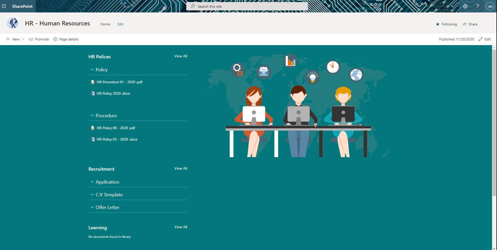
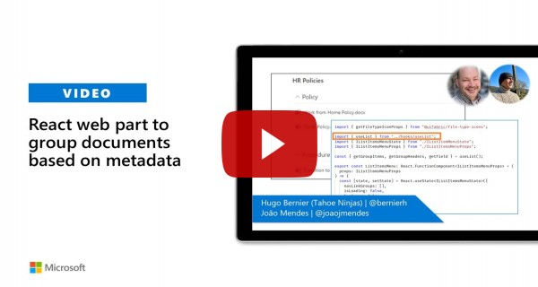

# List Items Menu

## Summary

This web part allows user create a navigation menu, grouped by any column of document library.
When the user clicks on the header it dynamically load documents.

## Screenshots

  

  

## Compatibility

| :warning: Important          |
|:---------------------------|
| Every SPFx version is only compatible with specific version(s) of Node.js. In order to be able to build this sample, please ensure that the version of Node on your workstation matches one of the versions listed in this section. This sample will not work on a different version of Node.|
|Refer to <https://aka.ms/spfx-matrix> for more information on SPFx compatibility.   |

 

-Incompatible-red.svg "SharePoint Server 2016 Feature Pack 2 requires SPFx 1.1")

## Applies to

* [SharePoint Framework](https://learn.microsoft.com/sharepoint/dev/spfx/sharepoint-framework-overview)
* [Microsoft 365 tenant](https://learn.microsoft.com/sharepoint/dev/spfx/set-up-your-development-environment)

## Web Part Properties
 
Property |Type|Required| comments
--------------------|----|--------|----------
Web Part Title| Text| no|
Select Document Library| dropdown|yes
Select Field to Group By | dropdown|yes
 

## Contributors

The Web Part Use PnPjs library, Fluent-Ui-react components

* [João Mendes](https://github.com/joaojmendes)
* [Ravi Chandra](https://github.com/Ravikadri)

## Version history

Version|Date|Comments
-------|----|--------
1.0.0|November 20, 2020|Initial release
1.0.1|February 18, 2021|Added support for metadata columns
1.0.2|February 21, 2021|Fixed `gulp build` issues
1.0.3|October 25, 2021|Fixed bug support for metadata columns and Lookup fields
1.0.4|October 31🦇, 2021|Upgraded to SPFx 1.13

## Minimal Path to Awesome

- Clone this repository (or [download this solution as a .ZIP file](https://pnp.github.io/download-partial/?url=https://github.com/pnp/sp-dev-fx-webparts/tree/main/samples/react-list-items-menu) then unzip it)
- Move to sample folder
- in the command line run:
  - `npm install`
  - `gulp build`
  - `gulp bundle --ship`
  - `gulp package-solution --ship`
- Add to AppCatalog and deploy
- go to SharePoint Admin Center and Approve required API Permissions

>  This sample can also be opened with [VS Code Remote Development](https://code.visualstudio.com/docs/remote/remote-overview). Visit https://aka.ms/spfx-devcontainer for further instructions.

## Video

## Disclaimer

**THIS CODE IS PROVIDED *AS IS* WITHOUT WARRANTY OF ANY KIND, EITHER EXPRESS OR IMPLIED, INCLUDING ANY IMPLIED WARRANTIES OF FITNESS FOR A PARTICULAR PURPOSE, MERCHANTABILITY, OR NON-INFRINGEMENT.**

## Help

We do not support samples, but we do use GitHub to track issues and constantly want to improve these samples.

If you're having issues building the solution, please run [spfx doctor](https://pnp.github.io/cli-microsoft365/cmd/spfx/spfx-doctor/) from within the solution folder to diagnose incompatibility issues with your environment.

You can try looking at [issues related to this sample](https://github.com/pnp/sp-dev-fx-webparts/labels/react-list-items-menu) to see if anybody else is having the same issues.

You can also try looking at [discussions related to this sample](https://github.com/pnp/sp-dev-fx-webparts/discussions?discussions_q=react-list-items-menu) and see what the community is saying.

If you encounter any issues while using this sample, [create a new issue](https://github.com/pnp/sp-dev-fx-webparts/issues/new?assignees=&labels=Needs%3A+Triage+%3Amag%3A%2Ctype%3Abug-suspected%2Csample%3A%20react-list-items-menu&template=bug-report.yml&sample=react-list-items-menu&authors=@joaojmendes%20@Ravikadri&title=react-list-items-menu%20-%20).

For questions regarding this sample, [create a new question](https://github.com/pnp/sp-dev-fx-webparts/issues/new?assignees=&labels=Needs%3A+Triage+%3Amag%3A%2Ctype%3Aquestion%2Csample%3A%20react-list-items-menu&template=question.yml&sample=react-list-items-menu&authors=@joaojmendes%20@Ravikadri&title=react-list-items-menu%20-%20).

Finally, if you have an idea for improvement, [make a suggestion](https://github.com/pnp/sp-dev-fx-webparts/issues/new?assignees=&labels=Needs%3A+Triage+%3Amag%3A%2Ctype%3Aenhancement%2Csample%3A%20react-list-items-menu&template=question.yml&sample=react-list-items-menu&authors=@joaojmendes%20@Ravikadri&title=react-list-items-menu%20-%20).

