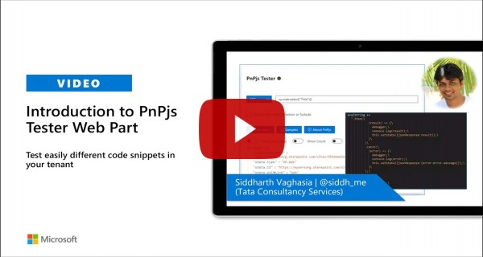

# Test PnPjs SharePoint Methods

This web part will allow SPFx developers to test [PnPjs](https://pnp.github.io/pnpjs/getting-started/) methods and it displays response in JSON viewer to identify properties/attributes returned by method/API. This web part can be used as separate component to test PnPjs methods and know the response returned by a particular method/API. To maximize productivity, we should package and deploy it to a test(developer) site collection which then can be used side by side when we are doing development of SPFx solutions.

Note - As of now it only supports to test PnPjs method from sp(SharePoint) packages which contains the fluent API used to call the SharePoint rest services.

You can refer to this blog [link](https://siddharthvaghasia.com/2020/08/16/usage-guide-on-spfx-pnpjs-tester-web-part/) for usage guidance on How to use this web part.


Idea behind this web part

- Most of the SharePoint developers are using PnPjs to develop SPFx solutions.
- During the development, there are times when we wanted to know what properties/attributes will be returned in response
- To get these details, we either use console.log to log response or debug the JavaScript and check what properties/attributes are returned etc.
- This web part can be used so that we can quickly test any SharePoint REST API methods using PnPjs.

Feel free to connect on twitter:@siddh_me or twitter:@sanganikunj for any details.

## Notes on Web part

- Web Part to test PnPjs SharePoint package methods
- Response will be displayed in a code format.
- By default, it will run in context of current site collection.
- Optional option to enter different site collection or sub site url to set PnPjs context to different url(other than current context)
- Support for Get and Post methods.
- Option to see some examples which can be copied and tested just by changing list/libraries/column names.

## Compatibility

| :warning: Important          |
|:---------------------------|
| Every SPFx version is only compatible with specific version(s) of Node.js. In order to be able to build this sample, please ensure that the version of Node on your workstation matches one of the versions listed in this section. This sample will not work on a different version of Node.|
|Refer to <https://aka.ms/spfx-matrix> for more information on SPFx compatibility.   |


-Incompatible-red.svg "SharePoint Server 2016 Feature Pack 2 requires SPFx 1.1")


## Applies to

- [SharePoint Framework](http://dev.office.com/sharepoint/docs/spfx/sharepoint-framework-overview)
- [Office 365 tenant](http://dev.office.com/sharepoint/docs/spfx/set-up-your-developer-tenant)

### Package and Deploy

Note - If you don't want to build and package on your own, you can directly download package at this [location](./sharepoint/solution/react-pnpjsexplorer.sppkg) and upload to app catalog and install app on required site collection. Skip below steps and directly go to How to use section.
Clone the solution and make sure there is no error before packaging. Try first on local work bench.

```bash
git clone the repo
npm i
gulp serve
```

- Execute the following gulp task to bundle your solution. This executes a release build of your project by using a dynamic label as the host URL for your assets. This URL is automatically updated based on your tenant CDN settings:

```bash
gulp bundle --ship
```

- Execute the following task to package your solution. This creates an updated web part `.sppkg` package on the `sharepoint/solution` folder.

```bash
gulp package-solution --ship
```

- Upload or drag and drop the newly created client-side solution package to the app catalog in your tenant.
- Based on your tenant settings, if you would not have CDN enabled in your tenant, and the `includeClientSideAssets` setting would be true in the `package-solution.json`, the loading URL for the assets would be dynamically updated and pointing directly to the `ClientSideAssets` folder located in the app catalog site collection.

## Contributors

*[Siddharth Vaghasia](https://www.linkedin.com/in/siddharthvaghasia/) and [Kunj Sangani](https://www.linkedin.com/in/kunj-sangani/)
* [Abderahman Moujahid](https://github.com/Abderahman88)|

## Version history

| Version | Date         | Comments        |
| ------- | ------------ | --------------- |
| 1.0.0   | Aug 14, 2020 | Initial Release |
| 2.1.0   | October 05, 2020 | Update to SPFx 1.11.0 |
| 2.1.1   | October 30, 2020 | Fixed button formatting issues |

## Video

[](https://www.youtube.com/watch?v=mdgkyxeayY0 "Introduction to PnPjs Tester Web Part")

## Help

We do not support samples, but we this community is always willing to help, and we want to improve these samples. We use GitHub to track issues, which makes it easy for  community members to volunteer their time and help resolve issues.

If you're having issues building the solution, please run [spfx doctor](https://pnp.github.io/cli-microsoft365/cmd/spfx/spfx-doctor/) from within the solution folder to diagnose incompatibility issues with your environment.

If you encounter any issues while using this sample, [create a new issue](https://github.com/pnp/sp-dev-fx-webparts/issues/new?assignees=&labels=Needs%3A+Triage+%3Amag%3A%2Ctype%3Abug-suspected%2Csample%3A%20react-pnpjsexplorer&template=bug-report.yml&sample=react-pnpjsexplorer&authors=@Abderahman88%20@siddharth-vaghasia%20@kunj-sangani&title=react-pnpjsexplorer%20-%20).

For questions regarding this sample, [create a new question](https://github.com/pnp/sp-dev-fx-webparts/issues/new?assignees=&labels=Needs%3A+Triage+%3Amag%3A%2Ctype%3Aquestion%2Csample%3A%20react-pnpjsexplorer&template=question.yml&sample=react-pnpjsexplorer&authors=@Abderahman88%20@siddharth-vaghasia%20@kunj-sangani&title=react-pnpjsexplorer%20-%20).

Finally, if you have an idea for improvement, [make a suggestion](https://github.com/pnp/sp-dev-fx-webparts/issues/new?assignees=&labels=Needs%3A+Triage+%3Amag%3A%2Ctype%3Aenhancement%2Csample%3A%20react-pnpjsexplorer&template=question.yml&sample=react-pnpjsexplorer&authors=@Abderahman88%20@siddharth-vaghasia%20@kunj-sangani&title=react-pnpjsexplorer%20-%20).

For any issue or help, Buzz us on twitter:([siddh_me](https://twitter.com/siddh_me/)) or ([sanganikunj](https://twitter.com/sanganikunj))

## Disclaimer

**THIS CODE IS PROVIDED *AS IS* WITHOUT WARRANTY OF ANY KIND, EITHER EXPRESS OR IMPLIED, INCLUDING ANY IMPLIED WARRANTIES OF FITNESS FOR A PARTICULAR PURPOSE, MERCHANTABILITY, OR NON-INFRINGEMENT.**


