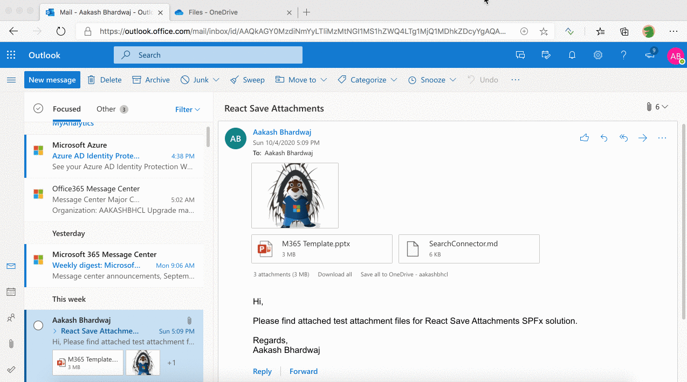
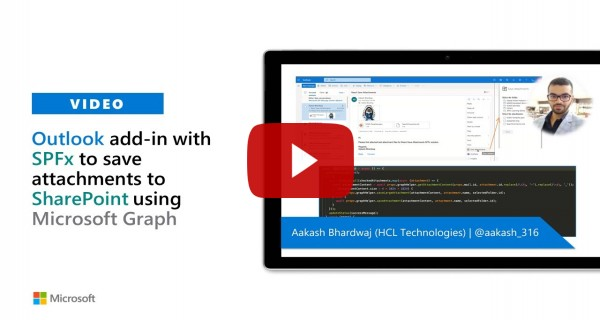

# Save Outlook Attachments

## Summary

This SPFx Outlook Add-In lets users save any email attachments to a OneDrive folder. The users can select any OneDrive folder/subfolder and choose the attachments that need to be saved. It uses Microsoft Graph API to fetch the OneDrive folders and upload the attachment files.

## Compatibility

| :warning: Important          |
|:---------------------------|
| Every SPFx version is only compatible with specific version(s) of Node.js. In order to be able to build this sample, please ensure that the version of Node on your workstation matches one of the versions listed in this section. This sample will not work on a different version of Node.|
|Refer to <https://aka.ms/spfx-matrix> for more information on SPFx compatibility.   |

 

-Incompatible-red.svg "SharePoint Server 2016 Feature Pack 2 requires SPFx 1.1")

## Features

This web part illustrates the below features for creating Outlook Add-Ins using SPFx.

* Select Office context and attributes of currently selected mail
* Requesting `Mail.Read` and `Files.ReadWrite` permission scopes for Microsoft Graph through the `webApiPermissionRequests` property in `package-solution.json`
* Use Microsoft Graph to retrieve folders and sub-folders for OneDrive
* Use Microsoft Graph to retrieve complete mail `mimestream` by given `ID`
* Use Microsoft Graph to save normal or big files (in size bigger 4MB) with different concepts

## Contributors

* [Aakash Bhardwaj](https://github.com/aakashbhardwaj619)

## Version history

Version|Date|Comments
-------|----|--------
1.0|October 4, 2020|Initial release
1.1|October 19, 2021|Upgraded to SPFx 1.13.0

## Minimal Path to Awesome

- Clone this repository (or [download this solution as a .ZIP file](https://pnp.github.io/download-partial/?url=https://github.com/pnp/sp-dev-fx-webparts/tree/main/samples/react-save-attachments) then unzip it)
* From your command line, change your current directory to the directory containing this sample (`react-save-attachments`, located under `samples`)
* In the command line run:
  * Restore dependencies: `npm install`
  From here you can also follow the deployment steps from the official [Microsoft Tutorial](https://learn.microsoft.com/sharepoint/dev/spfx/web-parts/get-started/office-addins-tutorial#packaging-and-deploying-your-solution-to-sharepoint)
  * Build solution `gulp build --ship`
  * Bundle solution: `gulp bundle --ship`
  * Package solution: `gulp package-solution --ship`
  * Locate solution at `.\sharepoint\solution\react-save-attachments.sppkg`
  * Upload it to your tenant app catalog
  * Go to your Outlook Web Access then double-click an e-mail to open it in a window
  * Choose **...** and **Get Add-ins**
  * Choose **My Add-ins** from left menu
  * Under **Custom add-ins**, choose **+ Add a custom add-in**, then **Add from file...**
  * Upload the manifest xml file from `\officeAddin` folder
  * Click **Install** on the warning message to get your add-in available on the tenant
* Go to the **API Management** section in the new SharePoint Admin Center (*https://{tenantname}-admin.sharepoint.com/_layouts/15/online/AdminHome.aspx#/webApiPermissionManagement*)
* **Approve** the permission request for **Mail.ReadWrite** and **Files.ReadWrite** to **Microsoft Graph**

>  This sample can also be opened with [VS Code Remote Development](https://code.visualstudio.com/docs/remote/remote-overview). Visit https://aka.ms/spfx-devcontainer for more information.

## Video

## Help

We do not support samples, but this community is always willing to help, and we want to improve these samples. We use GitHub to track issues, which makes it easy for  community members to volunteer their time and help resolve issues.

If you're having issues building the solution, please run [spfx doctor](https://pnp.github.io/cli-microsoft365/cmd/spfx/spfx-doctor/) from within the solution folder to diagnose incompatibility issues with your environment.

You can try looking at [issues related to this sample](https://github.com/pnp/sp-dev-fx-webparts/issues?q=label%3A%22sample%3A%20react-save-attachments") to see if anybody else is having the same issues.

You can also try looking at [discussions related to this sample](https://github.com/pnp/sp-dev-fx-webparts/discussions?discussions_q=react-save-attachments) and see what the community is saying.

If you encounter any issues while using this sample, [create a new issue](https://github.com/pnp/sp-dev-fx-webparts/issues/new?assignees=&labels=Needs%3A+Triage+%3Amag%3A%2Ctype%3Abug-suspected%2Csample%3A%20react-save-attachments&template=bug-report.yml&sample=react-save-attachments&authors=@aakashbhardwaj619&title=react-save-attachments%20-%20).

For questions regarding this sample, [create a new question](https://github.com/pnp/sp-dev-fx-webparts/issues/new?assignees=&labels=Needs%3A+Triage+%3Amag%3A%2Ctype%3Aquestion%2Csample%3A%20react-save-attachments&template=question.yml&sample=react-save-attachments&authors=@aakashbhardwaj619&title=react-save-attachments%20-%20).

Finally, if you have an idea for improvement, [make a suggestion](https://github.com/pnp/sp-dev-fx-webparts/issues/new?assignees=&labels=Needs%3A+Triage+%3Amag%3A%2Ctype%3Aenhancement%2Csample%3A%20react-save-attachments&template=question.yml&sample=react-save-attachments&authors=@aakashbhardwaj619&title=react-save-attachments%20-%20).

## Disclaimer

**THIS CODE IS PROVIDED *AS IS* WITHOUT WARRANTY OF ANY KIND, EITHER EXPRESS OR IMPLIED, INCLUDING ANY IMPLIED WARRANTIES OF FITNESS FOR A PARTICULAR PURPOSE, MERCHANTABILITY, OR NON-INFRINGEMENT.**

